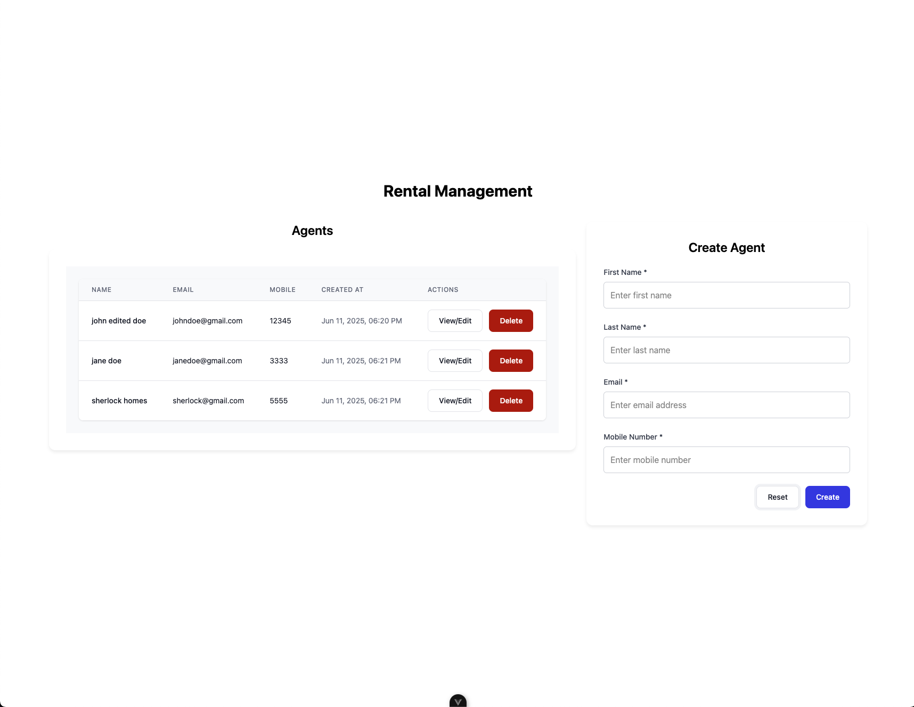
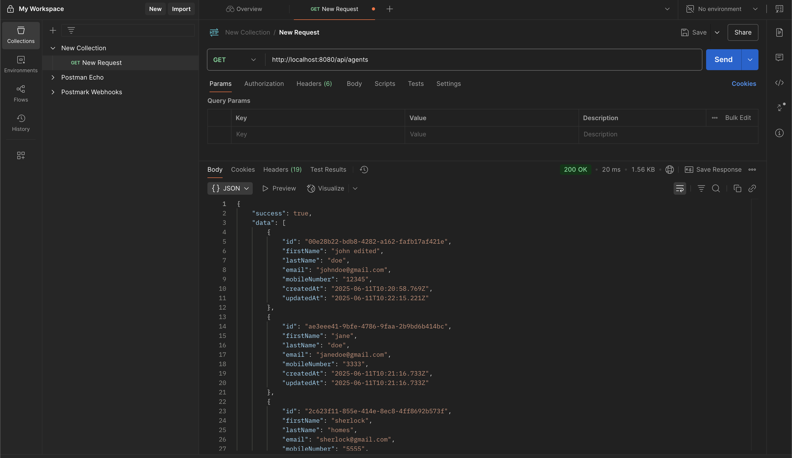
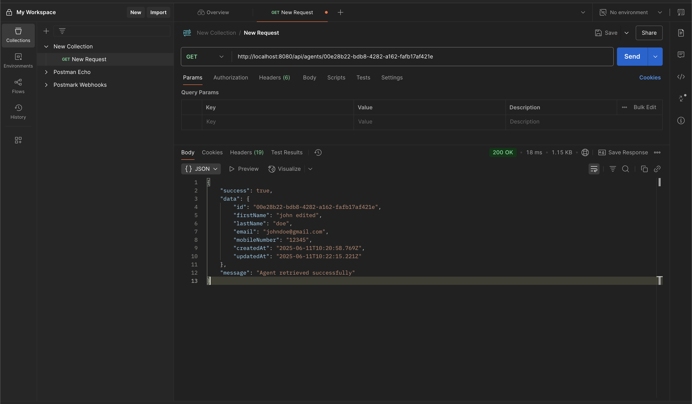
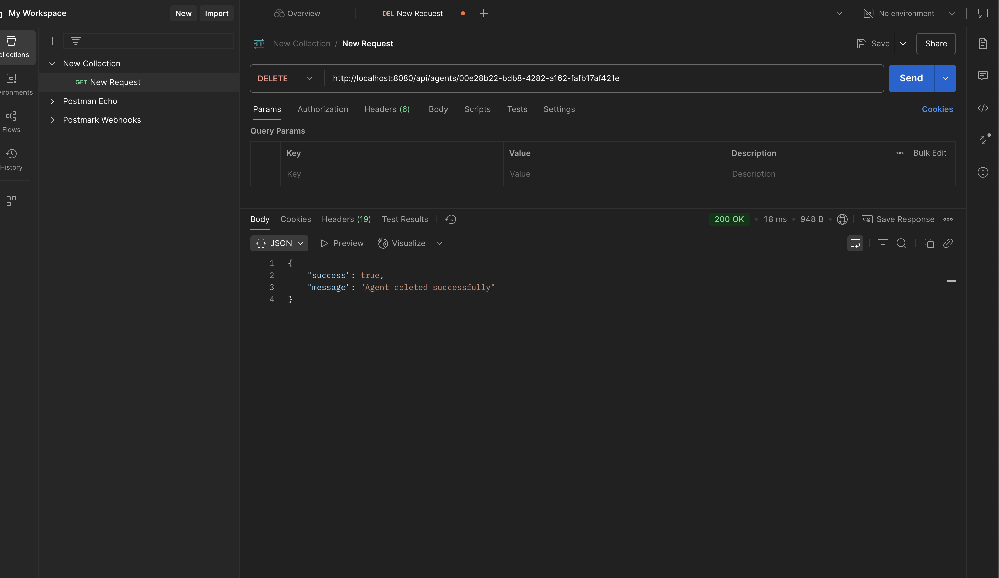
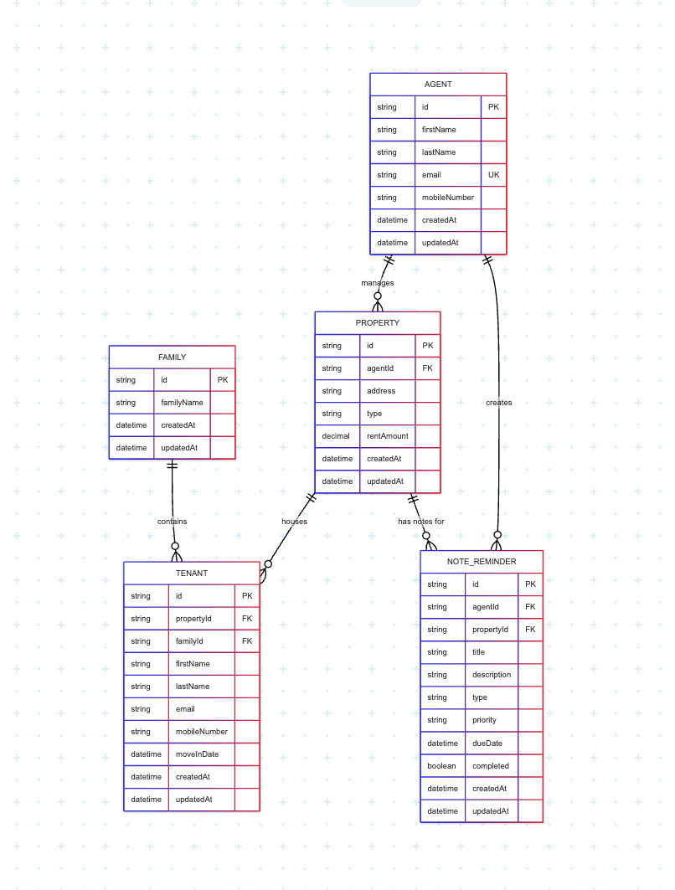

# Rental Management

## Set-up
- API (Express.js) - Go to backend folder, run ```npm install```, then run ```npm run dev```
- Client (Vue) - Go to client folder, run ```npm install```, then run ```npm run dev```

## Screenshots/Videos:

### Full features (CRUD)

Check out the link below the image for the full demo

(https://drive.google.com/file/d/1SlsHe8dlbi2-5woxrOfUGiXXpgrDXq5Z/view)

### Get all agents endpoint


### Get agent endpoint


### Delete agent endpoint


## ERD
Via Mermaid Chart



## Improvements
- A property can also be managed by multiple agents
- Use monorepo (Turborepo/NX)to manage both backend and frontend since they're both JavaScript
- Add a package called "shared" for shared types and utils between client and api
- Use token based authentication for client and api interaction
- Use code formatting (Eslinst, Prettier)
- Add testing for both client and backend
- Add loading indicator and disable for states
- Avoid using "any" types
- Add re-usable components for common elements
- Fix responsive layout
- Add state manangement for the frontend
- Separate components into smaller components